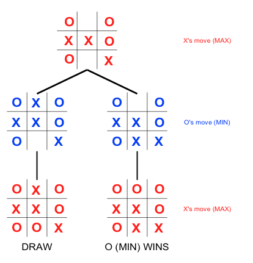
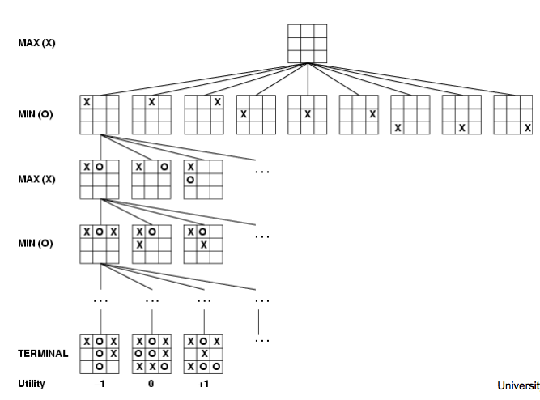
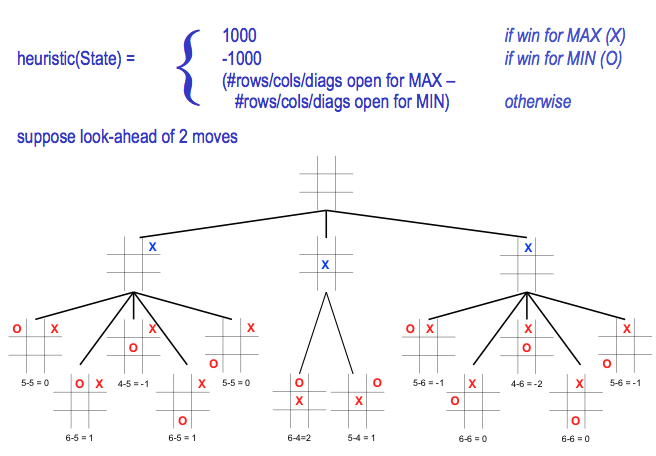
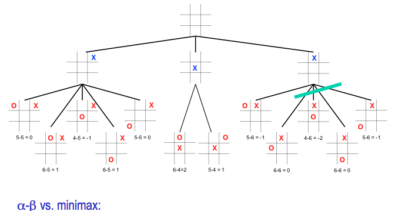
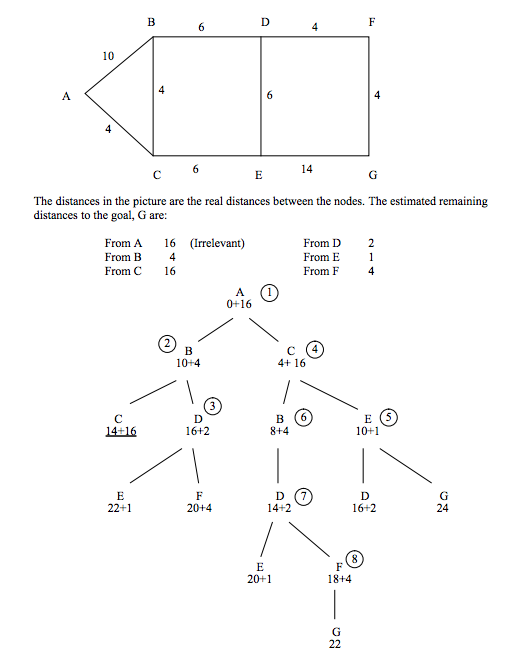

# Advanced Topics

Prolog is extermely useful in turn-based games, AI, and machine learning and is especially a great tool for prototyping these.

## Turn-Based Games

* 2 players
* Perfect information
* Zero-sum

## Search Trees

## Heuristics

## Alpha-Beta Pruning

Same example 

* [Full Tic-Tac-Toe example](http://www.csupomona.edu/~jrfisher/www/prolog_tutorial/5_3.html "Full Tic-Tac-Toe example")

## Best-First Search

## Machine Learning

Can store situations in the KB (not as easy as it sounds).

Real learning - we can store information with varied certainty.

Thanks [David Reed](http://dave-reed.com/), [Creighton University](http://www.creighton.edu/)

